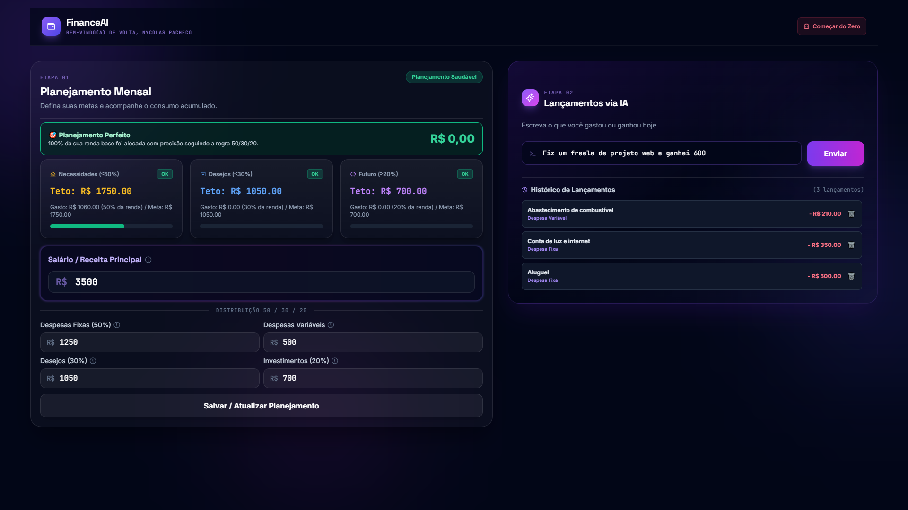

# 💸 FinanceAI - Gestor Financeiro Inteligente

Um gerenciador de finanças pessoais que utiliza Inteligência Artificial (Google Gemini) para registrar, interpretar e categorizar seus gastos automaticamente através de texto livre.

> **Nota**: Como o backend está hospedado no plano gratuito do Render, o servidor entra em modo de espera quando fica inativo. Por favor, aguarde cerca de 50 segundos para que o servidor inicie no seu primeiro acesso!

🌍 **Acesse o projeto online:** [Clique aqui para acessar o FinanceAI](https://finance-ai-pi-six.vercel.app/)



---

## 🚀 Tecnologias Utilizadas

**Frontend:**
* HTML5, CSS3 & JavaScript puro
* [Tailwind CSS](https://tailwindcss.com/) (via CDN para estilização rápida)
* Hospedagem: [Vercel](https://vercel.com/)

**Backend:**
* [Python 3.10+](https://www.python.org/)
* [FastAPI](https://fastapi.tiangolo.com/) (Criação da API e rotas)
* [SQLAlchemy](https://www.sqlalchemy.org/) + SQLite (Banco de Dados)
* Integração de IA: Google Gemini API
* Hospedagem: [Render](https://render.com/)

---

## ✨ Funcionalidades

* **Registro via IA:** Digite "Gastei 50 no mercado hoje" e a IA categoriza, extrai o valor e salva automaticamente.
* **Dashboard Dinâmico:** Visualização de receitas, despesas e saldo atualizado em tempo real.
* **Regra 50-30-20:** Análise inteligente de saúde financeira baseada nas suas metas.
* **Gerenciamento de Lançamentos:** Exclusão rápida de transações com atualização instantânea da interface.

---
## 📖 Como Usar a Aplicação

O fluxo do FinanceAI foi pensado para ser simples e direto, focado na experiência do usuário:

**1. Setup Inicial (Metas)**
* Ao acessar pela primeira vez, o sistema pedirá para você definir suas metas de gastos para diferentes categorias (Despesas Fixas, Variáveis, etc.).
* Esses valores servirão de base para a inteligência artificial calcular a saúde das suas finanças.

**2. Inserindo Lançamentos com IA**
* No campo de texto principal, você não precisa preencher formulários chatos. Basta digitar como se estivesse mandando uma mensagem.
* *Exemplos do que você pode digitar:* 
  * "Recebi 3500 de salário hoje"
  * "Gastei 150 de mercado"
  * "Paguei 80 reais de internet"
* A IA vai ler, identificar a categoria correta, extrair o valor monetário e salvar no banco de dados.

**3. Feedback e Alertas**
* Toda vez que você adiciona um gasto, a IA analisa o impacto dele no seu orçamento. 
* Ela pode retornar alertas de cuidado (se você estiver estourando a meta de Despesas Variáveis, por exemplo) ou mensagens de incentivo se você estiver economizando bem.

**4. Acompanhamento (Dashboard)**
* A tela principal exibe o cálculo em tempo real baseado na **Regra 50-30-20** (Necessidades, Desejos e Poupança).
* Você pode visualizar todo o histórico e, caso a IA erre a categoria ou você desista de uma compra, basta clicar no ícone de lixeira para apagar o lançamento instantaneamente.

---

## 📋 Pré-requisitos (Requirements)

Para rodar este projeto localmente, você precisará de:
* Python 3.10 ou superior instalado.
* Uma chave de API gratuita do [Google AI Studio](https://aistudio.google.com/app/apikey).
* Git instalado na sua máquina.

---

## 🔧 Como Rodar Localmente

**1. Clone o repositório:**
```bash
git clone https://github.com/nycpacheco/FinanceAi.git
cd FinanceAi
```

**2. Crie e ative um ambiente virtual (Opcional, mas recomendado):**
```bash
python -m venv venv
# No Windows:
venv\Scripts\activate
# No Mac/Linux:
source venv/bin/activate
```

**3. Instale as dependências do backend:**
```bash
pip install -r requirements.txt
```

**4. Configure as Variáveis de Ambiente:**
Crie um arquivo `.env` na raiz do projeto e adicione sua chave da API do Gemini:
```env
GEMINI_API_KEY=sua_chave_aqui
```

**5. Inicie o servidor local:**
```bash
uvicorn src.main:app --reload
```
A API estará rodando em `http://localhost:8000`.

**6. Rodando o Frontend:**
Como o frontend é estático (HTML/JS), basta abrir o arquivo `index.html` diretamente no seu navegador ou usar a extensão *Live Server* do VS Code. (Lembre-se de alterar a URL de fetch no JS de volta para `localhost:8000` para testes locais).

---

## ✒️ Autor

Desenvolvido por **Nycolas Pacheco**!

[](https://www.linkedin.com/in/nycpacheco/)
[](https://github.com/nycpacheco)
